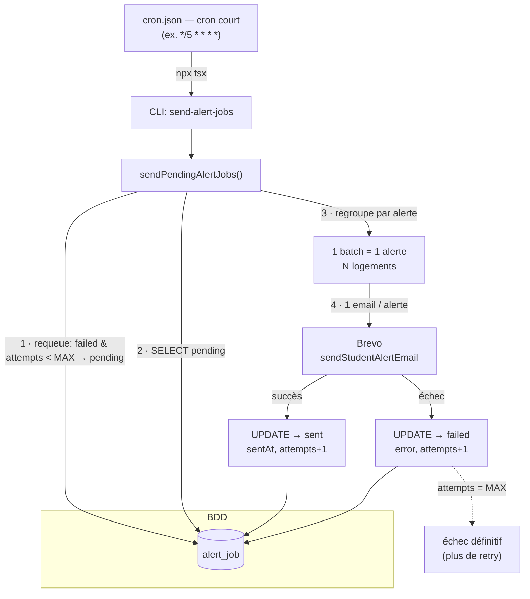

# ADR 0001 — Alert sender (envoi par batch des alertes logement)

Statut : accepté · Domaine : notifications étudiants · Lié à [ADR 0002](./0002-alert-detection.md)

## Contexte

Les étudiants configurent des **alertes** (`student_alert`) décrivant une recherche
de logement (ville/département/académie, prix max, colocation, accessibilité). Quand
un logement correspond à une alerte, un **job d'envoi** (`alert_job`) est créé. Le rôle
d'`alert-sender` est uniquement de **consommer** ces jobs : il transforme les jobs
`pending` en emails et met à jour leur statut. Il ne décide pas *quand* un logement
matche une alerte — cette **production de jobs** est traitée par le détecteur,
décrit dans l'[ADR 0002](./0002-alert-detection.md).

## Décision

L'envoi est un **batch idempotent piloté par un cron**, et non un envoi synchrone au
moment du matching. Ce découplage via la table `alert_job` permet :

- de **regrouper** plusieurs logements en **un seul email par alerte**;
- de **rejouer** sans risque : seuls les jobs `pending` sont traités, donc un job déjà
  `sent` n'est jamais renvoyé ;
- de **tracer** chaque tentative (`status`, `attempts`, `sentAt`, `error`).

### Mécanique de `sendPendingAlertJobs()`

1. **Replanifie les échecs récupérables** : tout job `failed` dont `attempts < MAX_ATTEMPTS`
   repasse en `pending` (et son `error` est effacé). C'est le **retry automatique**.
2. Sélectionne tous les `alert_job` en statut `pending` (jointure `user` + `accommodation`),
   ce qui inclut les jobs tout juste replanifiés.
3. **Regroupe par alerte** : une `Map<studentAlertId, batch>` accumule les logements et les
   `jobIds`. Un étudiant ayant plusieurs alertes reçoit un mail par alerte, ce qui évite aussi
   qu'une résidence matchée par deux alertes soit dupliquée dans un même mail.
4. Pour chaque alerte : envoie **un** email via Brevo (`sendStudentAlertEmail`).
5. Selon le résultat, met à jour **tous les jobs du batch** :
   - succès → `status = 'sent'`, `sentAt = now`, `attempts + 1` ;
   - échec → `status = 'failed'`, `error = message`, `attempts + 1`.

Le résultat renvoyé est `{ sent, failed, requeued }`. `--dry-run` simule sans rien écrire
(les échecs récupérables sont seulement comptés et inclus dans la sélection), `--verbose`
détaille chaque étudiant.

### Politique de retry

Un job dispose de **`MAX_ATTEMPTS` tentatives au total** (constante exportée par
`alert-sender.ts`, valeur `3`). À chaque exécution du cron, les jobs `failed` encore sous
ce plafond sont remis en `pending` puis réessayés ; `attempts` est incrémenté à chaque
envoi. Une fois `attempts` égal à `MAX_ATTEMPTS`, le job reste **`failed` définitivement**
et n'est plus replanifié (intervention manuelle requise pour le forcer). Avec deux créneaux
par jour, le budget de tentatives d'un job s'épuise donc en ~1 journée.

## Récurrence

La planification vit dans `cron.json` (et non dans le code applicatif). Depuis le passage de
la **production en mode événementiel** (cf. [ADR 0002](./0002-alert-detection.md)), les jobs
sont créés au fil de l'eau ; pour une livraison quasi-instantanée, le sender tourne sur un
**cron court** (par ex. toutes les 5 minutes) qui draine les `pending` :

```
*/5 * * * *  npx tsx cli/index.ts send-alert-jobs
```

> La cadence exacte est gérée par l'opérateur dans `cron.json`. Le batching (1 mail/alerte)
> et l'idempotence rendent un drainage fréquent sûr : un réveil sans `pending` ne fait rien.



À chaque réveil du cron : les `failed` encore sous le plafond sont replanifiés, puis tous
les `pending` (nouveaux + replanifiés) sont traités ; les `sent` sont ignorés, ce qui rend
les exécutions répétées sûres — d'où la possibilité d'un cron court sans risque.