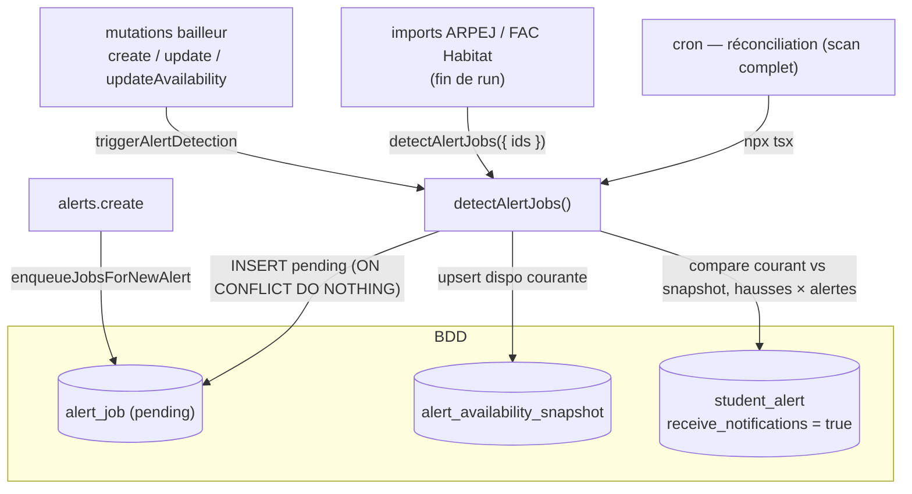

# ADR 0002 — Détection des alertes de disponibilité (producteur des `alert_job`)

Statut : accepté · Domaine : notifications étudiants · Lié à [ADR 0001](./0001-alert-sender.md)

## Contexte

L'[ADR 0001](./0001-alert-sender.md) décrit le **consommateur** (envoi des `alert_job` en
attente). Ce document décrit le **producteur** : le traitement qui décide *quand* créer un
job, c'est-à-dire la détection des **hausses de disponibilité**.

Une alerte étudiant (`student_alert`) est une alerte **« logement dispo »**. On notifie
l'étudiant quand le **nombre total de logements disponibles** d'une résidence de sa zone
**augmente** :

| Avant | Après | Déclenche ? |
|-------|-------|-------------|
| non-renseigné (tous `nb_t*_available` à `null`) | `x` (>0) | ✅ |
| `0` | `x` (>0) | ✅ |
| `x` | `y` avec `y > x` | ✅ |
| non-renseigné | `0` | ❌ |
| `x` | `y` avec `y ≤ x` (baisse/égalité) | ❌ |

Règle unique : **déclenche si `dispo_courante > 0` ET `dispo_courante > dispo_précédente`**,
le « non-renseigné » comptant comme une base inférieure à 0.

## Décision

### Pourquoi un snapshot

Détecter une *hausse* impose de connaître l'état *précédent*. Or aucune source d'événements
fiable n'existe :
- `accommodation.updatedAt` indique qu'il y a eu un changement, pas son **sens** (hausse vs baisse).
- `activity_log` n'enregistre les variations de dispo que pour les modifications faites
  **depuis l'espace bailleur** — les imports (source majoritaire) et autres écritures n'y passent pas.

On mémorise donc nous-mêmes la dernière dispo vue par résidence dans une table dédiée
**`alert_availability_snapshot`** (`accommodation_id` PK, `available_count` nullable où
`null` = non-renseigné, `updated_at`). Cette approche est **agnostique à la source** du
changement (import, bailleur, admin…).

### Mécanique de `detectAlertJobs()`

À chaque run (`src/server/services/alert-detector.ts`) :

1. `isFirstRun` = la table snapshot est vide.
2. Calcule la **dispo courante** de chaque résidence en périmètre (**publiée, hors CROUS**),
   et récupère la **dispo précédente** via `LEFT JOIN` sur le snapshot.
3. Détermine les résidences **en hausse** (règle ci-dessus). Au tout premier run, on ne
   déclenche rien : on se contente d'enregistrer la **baseline** (anti-spam).
4. Pour chaque **alerte active** (`receive_notifications = true`), filtre les résidences en
   hausse par les critères de l'alerte (territoire / prix / coliving / accessibilité, hors
   CROUS) via `buildAlertMatchConditions` — **la même logique que la recherche** (module
   partagé `src/server/services/alert-matching.ts`).
5. Insère les `alert_job` (`pending`) avec `ON CONFLICT DO NOTHING`.
6. Met à jour le snapshot avec la dispo courante de **toutes** les résidences en périmètre.

`--dry-run` calcule et logue sans rien écrire. `--verbose` détaille les compteurs.
`detectAlertJobs({ accommodationIds })` restreint le scan à ces résidences (mode
événementiel ci-dessous) ; sans ce filtre, scan complet (réconciliation).

### Production événementielle (instantané)

Plutôt que d'attendre un cron, on produit les jobs **au moment où la donnée change**.
Deux natures complémentaires :

- **Flux « push » (hausse de dispo)** — à chaque écriture de dispo, on appelle
  `detectAlertJobs` **scopé** aux résidences touchées. Branché sur :
  - les 3 mutations bailleur (`create`, `update` si un champ `*Available` est fourni,
    `updateAvailability`) via `triggerAlertDetection` (best-effort, Sentry, ne bloque jamais
    l'écriture) ;
  - les imports qui écrivent la dispo (**ARPEJ iBail**, **FAC Habitat**) en fin de run
    (`cli/factory.ts`).
- **Flux « pull » (stock déjà disponible)** — une résidence déjà dispo et stable ne produit
  jamais de hausse. À la **création d'une alerte** (`alerts.create`), `enqueueJobsForNewAlert`
  scanne les résidences **actuellement disponibles** (`dispo > 0`) qui matchent l'alerte et
  enfile les jobs. Ne touche pas le snapshot (réservé aux deltas du flux push).

Le **cron de détection** ne disparaît pas : il devient un **filet de réconciliation**
(scan complet) qui rattrape les chemins non hookés — notamment le passage
`published: false → true` (imports CSV/CROUS, admin), qui fait *apparaître* une résidence
sans hausse de dispo.

> **Baseline obligatoire.** Avant d'activer l'événementiel, jouer **une fois**
> `seed-alert-snapshot` : il amorce le snapshot pour tout le stock publié. Ainsi
> « pas de snapshot » signifie ensuite « résidence réellement nouvelle », et une édition
> anodine d'une résidence déjà disponible ne ressemble pas à une apparition (anti-spam).

### Périmètre & cas particuliers

- **Hors CROUS** : hérité de la règle de matching existante (les résidences CROUS sont déjà
  exclues de la recherche). À réaffiner avec le métier ultérieurement.
- **Territoire obligatoire** : seules les alertes dotées d'un territoire (ville/département/
  académie) sont traitées. Une alerte sans territoire matcherait tout le pays → exclue par le
  détecteur, et refusée à la création (`ZCreateAlertRequest`).
- **Nouvelle résidence** apparaissant après la baseline : sans ligne de snapshot, elle est
  traitée comme `0 → x` et **déclenche** si sa dispo > 0 (couvre les nouvelles résidences).
- **Retour à « non-renseigné »** : passif — on mémorise l'état, on ne déclenche pas.
- **Granularité** : on suit le **total** de la résidence, pas par typologie (T1/T2…).

### Re-notification et index unique partiel

Pour autoriser une **2ᵉ notification** quand la dispo remonte (`x → y` après un envoi déjà
fait), la contrainte unique de `alert_job` est remplacée par un **index unique partiel** qui ne
porte que sur les jobs **actifs** — en attente (`pending`) ou en échec encore réessayable
(`failed` sous le plafond de tentatives) :

```sql
CREATE UNIQUE INDEX alert_job_active_unique
  ON alert_job (user_id, student_alert_id, accommodation_id)
  WHERE status = 'pending' OR (status = 'failed' AND attempts < 3);
```

> Le `3` doit rester en phase avec `MAX_ATTEMPTS` (`alert-sender.ts`).

Effet :
- plusieurs hausses **avant** l'envoi → un seul job actif (coalescence → un seul email) ;
- une hausse **après** un envoi → nouvelle ligne → re-notification ;
## Récurrence



La production est désormais **événementielle** (quasi-instantanée) ; le cron ne sert plus
que de **réconciliation** et peut tourner moins souvent (ex. une fois par nuit). L'envoi est
assuré par un cron court côté sender (cf. [ADR 0001](./0001-alert-sender.md)).

## Observabilité

Chaque run est tracé dans `import_jobs` (type `alert-detection`, `summary.context =
{ triggered, jobsCreated, seeded }`), visible dans l'admin **« Tâches planifiées »**. En cas
d'erreur, le run est marqué `error` et l'exception est envoyée à **Sentry** (`cli/sentry.ts`,
init + `flush` car le process CLI sort aussitôt — Sentry n'est pas câblé hors runtime Next).
## Conséquences

- ✅ Détection **quasi-instantanée** : produite au fil des écritures (push) et à la création
  d'alerte (pull), plus à la merci d'un créneau cron.
- ✅ Détection des hausses agnostique à la source du changement (import, bailleur, admin).
- ✅ Matching strictement identique à la recherche (logique partagée, pas de divergence).
- ✅ Anti-spam : baseline amorcée (`seed-alert-snapshot`), dédup/coalescence via l'index partiel.
- ✅ Re-notification possible sur hausses successives, historique des envois préservé.
- ✅ Robustesse : hooks best-effort + cron de réconciliation comme filet (couvre les chemins
  non hookés, dont le passage `published`).
- ⚠️ Le baseline (`seed-alert-snapshot`) doit être joué **avant** d'activer l'événementiel.
- ⚠️ L'apparition par **publication** (`published: false → true`) n'est pas instantanée :
  rattrapée au prochain cron de réconciliation.

